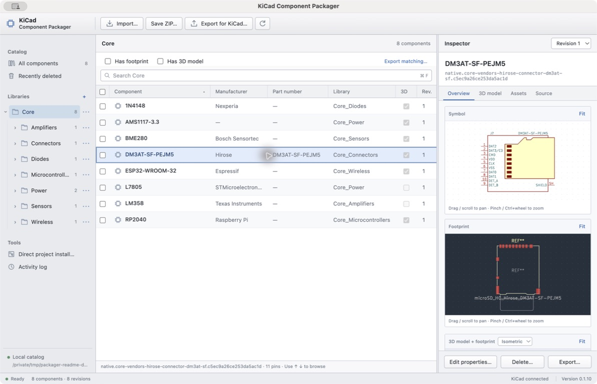
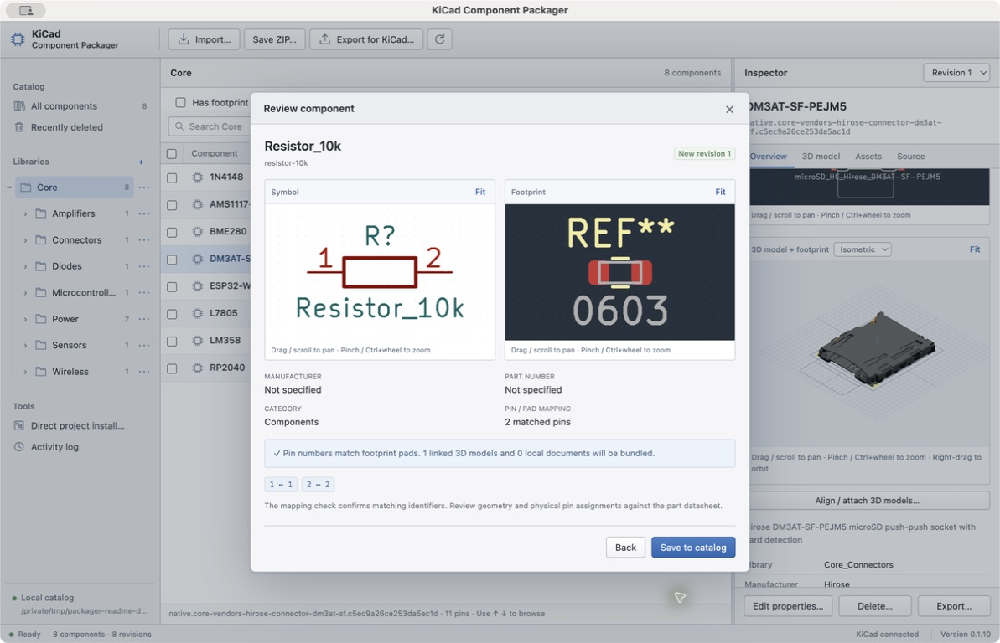
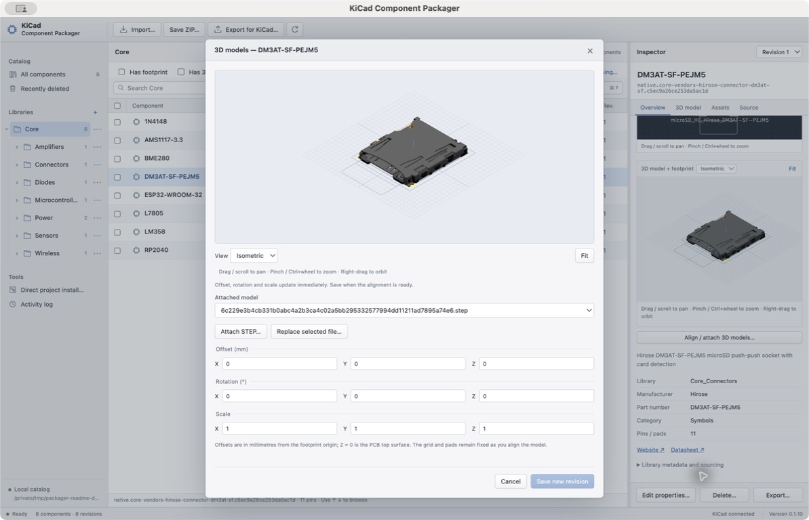

# KiCad Component Packager

Organize KiCad components into portable library collections. Bundle symbols, footprints, 3D models, documents and assembly metadata in **one ZIP** that installs through KiCad’s Plugin and Content Manager and reopens in Packager with its library tree and revision history.

An independent companion to KiCad, built with Electron and Python. This repository contains the Component Packager application.

[Download a preview release](https://github.com/zacharynevin/kicad-component-packager/releases) · [Desktop guide](docs/desktop.md) · [Build instructions](docs/building.md) · [Report a problem](https://github.com/zacharynevin/kicad-component-packager/issues)



Organize libraries into folders and inspect a component's linked assets alongside the component list.

## What it does

- Import KiCad libraries, native PCM ZIPs, Eagle libraries and board modules, and supported Altium files. Public GitHub repositories and direct download links are also supported.
- Arrange nested library folders; rename, move, merge, and delete libraries or selected components. Recover individual revisions from Recently deleted.
- Edit manufacturer, part number, website and other properties. Changes create immutable revisions.
- Inspect symbols, footprints and STEP/WRL models with mouse and trackpad navigation. Adjust model placement interactively.
- Generate short or stacking male/female headers for board-derived modules and include their assembly requirements.
- Filter by **Has footprint**, **Has 3D model**, or both, then **Export ZIP… → Current view**. Library and text filters combine with these checks; export includes matches across all pages.
- Use one **Export ZIP…** action for the entire collection, current view, checked components, or an inspected revision. Full exports preserve the library tree, source assets, package settings and component history; narrower exports include the chosen components and their dependencies.

The [Core library tools](tools/core_library/README.md) reorganize the full standard KiCad selection while preserving unpaired generic and utility symbols. Desktop PCM import supports these large collections, including standalone footprints. Asset filters describe what is bundled, rather than certifying a part’s physical suitability.

## A closer look

Review the symbol, footprint and pin-to-pad identifiers before saving an imported component.



Pan, zoom and orbit the 3D preview. Offset, rotation and scale adjustments appear immediately; save the finished alignment as a new revision.



Screenshots show version 0.1.10 on macOS with a demonstration catalog using public KiCad components and the bundled example library. The pictured Core collection is sample content, separate from the application download.

## Download and run

Choose the ZIP for **macOS Apple Silicon**, **macOS Intel**, or **Windows x64** from [Releases](https://github.com/zacharynevin/kicad-component-packager/releases). Extract the entire ZIP. On macOS, open the `.app`; on Windows, open the `.exe` and keep its adjacent files and `resources` folder together.

These are preview builds. macOS packages use an ad hoc signature and are not notarized; Windows packages are not publisher-signed. OS security controls may require approval. Build locally if your organization requires a trusted local build.

Python and the desktop runtime are bundled. Install **KiCad 10+** separately for schematic/footprint previews and Eagle/Altium conversion. The interactive 3D viewer is bundled. KiCad itself and the standard libraries are not included in the application download.

## Run from source

Install Git, **Node.js 24+**, and **Python 3.11+** (Python 3.13 is used for release builds). Use a terminal on macOS or PowerShell on Windows:

```sh
git clone https://github.com/zacharynevin/kicad-component-packager.git
cd kicad-component-packager
npm ci
npm run setup
npm run desktop
```

To create a distributable ZIP for your current platform:

```sh
npm run package:desktop
```

Packages are written to `outputs/desktop/`. Build macOS packages on a Mac with the corresponding architecture; build Windows x64 on Windows x64. [Detailed build instructions](docs/building.md) cover platform selection, validation, CI artifacts and releases.

## Tests

```sh
python3 -m unittest discover -s tests
npm run build:viewer
npm run check:desktop
```

On Windows use `python` in place of `python3`. The unit tests use bundled fixtures and temporary catalogs; KiCad and network access are not required. Optional integration checks are described in [validation](docs/validation.md).

## Source map

| Directory | Purpose |
| --- | --- |
| `partshelf/` | Python import, catalog, revision and PCM packaging backend |
| `partshelf/static/` | Desktop interface; [the CSS](partshelf/static/style.css) lives here |
| `desktop/` | Electron shell, packaging scripts and interactive 3D viewer source |
| `tests/` | Python and JavaScript tests, including STEP conversion fixtures |
| `examples/` | Small original demonstration library |
| `tools/core_library/` | Full-selection KiCad Core library organization and validation tools |

Catalogs stay in your local application-data directory. They are not part of this repository. No accounts are needed for local library packaging.

## License

The application’s own source is [MIT licensed](LICENSE), copyright Zachary Nevin. Third-party runtimes and KiCad assets retain their licenses; see [THIRD_PARTY_NOTICES.md](THIRD_PARTY_NOTICES.md). Imported components retain their original source licensing. This project is not affiliated with or endorsed by KiCad.
